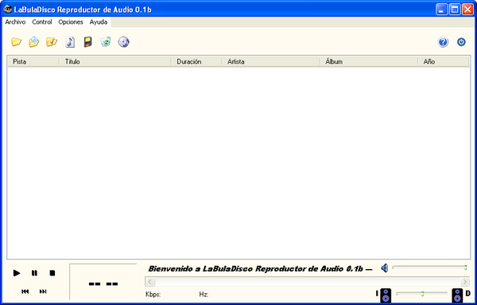
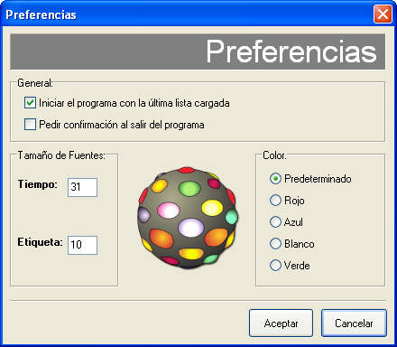

# LaBulaDisco Reproductor de Audio

_Te van a dar ganas de bailar._

## Información:

*LaBulaDisco* es un sencillo y ligero reproductor de audio hecho en 2008 como trabajo final para la materia Programación Orientada a Objetos de la carrera Ingeniería en Informática de la Facultad de Ingeniería y Ciencias Hídricas de la Universidad Nacional del Litoral (FICH-UNL).

Como recuerdo hago ahora público el código fuente de la misma, para rememorar viejas épocas. Está escrito en C++ usando Borland C++ Builder 6. Para la reproducción de audio se utilizó la librería FMOD Ex SoundSystem 4.12.07. Para el ícono de la aplicación se usó Macromedia Flash.

Creado junto a Facundo Curie.

<!-- El archivo de instalación es creado con Nullsoft Scriptable Install System (NSIS). -->

## Algunas imágenes:

